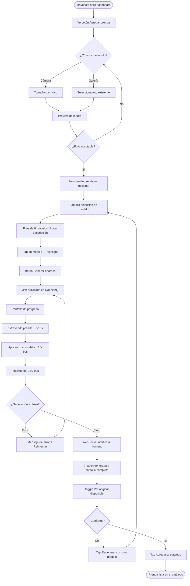
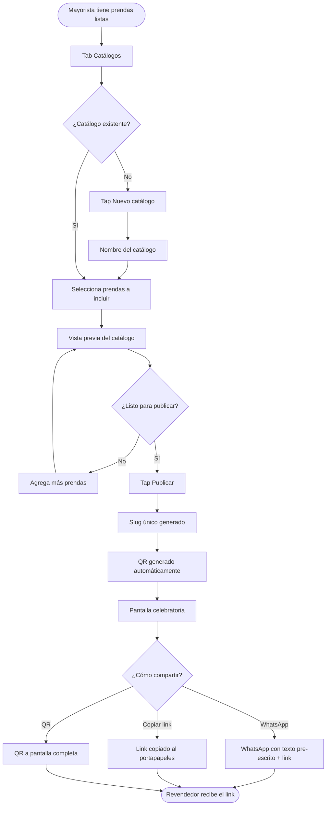
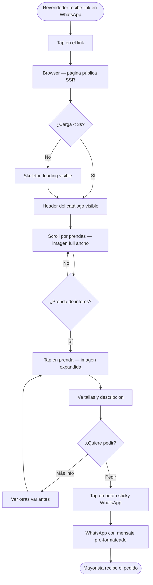

# UX Design Specification — Virtual Closet

## NikaCommerce

---

## Executive Summary

### Project Vision

Virtual Closet convierte fotos planas de prendas en catálogos profesionales con modelos IA, y los distribuye a revendedores vía link compartible — sin fotógrafo, sin app, en menos de 5 minutos.

### Target Users

| Usuario | Contexto | Dispositivo | Tech savvy |
| --- | --- | --- | --- |
| **Mayorista** | Sube prendas, genera catálogo, lo comparte por WhatsApp | Mobile principalmente, desktop para gestión | Bajo — opera por WhatsApp e Instagram |
| **Revendedor** | Recibe el link, navega el catálogo, decide qué pedir | Mobile (abre link desde WhatsApp) | Muy bajo — no instala nada |

### Key Design Challenges

1. **Onboarding sin fricción para el mayorista** — Opera en WhatsApp, no en dashboards. El primer catálogo tiene que ser generado con el mínimo de pasos posibles.
2. **Estado de espera del procesamiento IA** — La generación tarda 30–90s. La UX tiene que manejar esa espera sin ansiedad.
3. **Catálogo público mobile-first para el revendedor** — Tiene que abrir perfecto desde un link de WhatsApp en un teléfono Android básico, sin login, sin fricción.

### Design Opportunities

1. **El momento WOW** — Cuando el mayorista ve por primera vez su prenda sobre un modelo real. Ese momento tiene que estar diseñado conscientemente — es el principal driver de retención.
2. **Compartir con un tap** — El botón de compartir catálogo por WhatsApp tiene que ser el CTA más prominente del dashboard.
3. **Confianza visual del catálogo** — El revendedor abre el link sin contexto previo. El catálogo tiene que comunicar profesionalismo desde el primer scroll.

---

## Core User Experience

### Defining Experience

Hay dos loops de uso completamente distintos que deben diseñarse en paralelo:

#### Loop del Mayorista (productivo, recurrente)

```text
Subir fotos de prenda → Seleccionar modelo IA → Esperar generación
→ Revisar resultado → Publicar catálogo → Compartir link por WhatsApp
```

La acción más frecuente es **subir prendas y compartir el catálogo**. Todo lo demás es soporte a ese flujo. La UX debe hacer que ese ciclo completo sea posible en menos de 5 minutos desde cualquier teléfono.

#### Loop del Revendedor (pasivo, consultivo)

```text
Recibir link por WhatsApp → Abrir catálogo → Navegar prendas
→ Ver detalle con modelo → Decidir qué pedir → Contactar al mayorista
```

El revendedor nunca crea nada — solo consume. La fricción cero es el único objetivo de su experiencia.

### Platform Strategy

| Superficie | Plataforma | Prioridad | Justificación |
| --- | --- | --- | --- |
| Dashboard del mayorista | Web responsive, mobile-first | Alta | Opera desde teléfono, gestión ocasional desde desktop |
| Catálogo del revendedor | Web pública SSR, mobile-first | Crítica | Llega desde link de WhatsApp en Android básico |
| Upload de prendas | Web + PWA (camera access) | Alta | Permite captura directa desde cámara del teléfono |
| App nativa | No en MVP | — | Link web cubre el caso de uso sin fricción de instalación |

Consideraciones de plataforma:

- **Android básico (4G, pantalla 5–6")** es el dispositivo de referencia para el revendedor
- **Sin offline** — el catálogo requiere conexión; no hay acciones críticas offline
- **Camera API** para upload directo desde cámara en mobile

### Effortless Interactions

Estas acciones deben requerir cero pensamiento del usuario:

- **Subir foto:** tap en el área de upload → cámara o galería → foto seleccionada. Sin formularios previos.
- **Seleccionar modelo IA:** grid visual de modelos con preview. Un tap selecciona y dispara la generación.
- **Compartir catálogo:** botón fijo "Compartir por WhatsApp" siempre visible en el dashboard. Un tap abre WhatsApp con el link y texto pre-escrito.
- **Navegar catálogo (revendedor):** scroll vertical infinito, imágenes que cargan progresivamente. Sin paginación, sin filtros complejos en MVP.

Lo que debe pasar **automáticamente** sin acción del usuario:

- Generación de thumbnail al completar cada imagen IA
- Generación del código QR al publicar el catálogo
- Pre-escritura del mensaje de WhatsApp con el link del catálogo

### Critical Success Moments

**Momento 1 — El WOW del mayorista** *(make-or-break)*

Cuando el mayorista ve por primera vez su prenda procesada sobre un modelo real. Si este momento no genera una reacción positiva inmediata, no hay retención. El diseño debe:

- Mostrar la imagen generada con una transición suave (no un parpadeo)
- Poner la imagen IA al lado de la foto original para que el contraste sea inmediato
- El texto contextual debe ser mínimo — la imagen habla sola

**Momento 2 — Primer catálogo compartido** *(primer valor entregado)*
El mayorista comparte el link por primera vez. El flujo debe terminar con una confirmación satisfactoria: "Tu catálogo está listo. Compártelo con tus revendedores." Un botón directo a WhatsApp.

**Momento 3 — El revendedor abre el link** *(confianza inmediata)*
Los primeros 3 segundos del catálogo determinan si el revendedor se queda o cierra. La primera imagen tiene que cargarse rápido y verse profesional. Sin pantallas de carga largas, sin logins, sin popups.

**Momento crítico de fallo — Espera de procesamiento IA**
Si el mayorista sube una prenda y no recibe feedback durante 90 segundos, asume que algo falló. La UX debe mostrar progreso real y continuo desde el momento de upload.

---

## Desired Emotional Response

### Primary Emotional Goals

| Usuario | Emoción primaria | Emoción secundaria | Emoción a evitar |
| --- | --- | --- | --- |
| **Mayorista** | **Orgullo** — "mi catálogo se ve igual que el de una marca grande" | Alivio — "ya no necesito gastar $800 en fotos" | Ansiedad durante la espera, frustración por errores |
| **Revendedor** | **Confianza** — "puedo ver cómo se ve la prenda de verdad" | Deseo — "quiero pedir esta" | Desconfianza — "esto parece photoshop" |

### Emotional Journey Mapping

| Momento | Mayorista | Revendedor |
| --- | --- | --- |
| Primer contacto con el producto | Escepticismo → curiosidad | — |
| Sube la primera prenda | Incertidumbre ("¿se verá bien?") | — |
| Ve la imagen generada por primera vez | **Sorpresa → orgullo** | — |
| Comparte el catálogo | Alivio + anticipación | — |
| Abre el link del catálogo | — | Curiosidad |
| Ve la prenda sobre el modelo | — | **Confianza → deseo de comprar** |
| Error o fallo técnico | Frustración | — |
| Regresa a usar el producto | Hábito + confianza | — |

### Micro-Emotions

- **Escepticismo del mayorista** → barrera de entrada principal. El free trial de 5 prendas existe para romper esto antes de pedir tarjeta.
- **Desconfianza del revendedor** → el catálogo debe evitar cualquier señal visual que parezca edición exagerada. Luz natural, textura visible, caída de tela realista.
- **Ansiedad en la espera** → 30–90s sin feedback convierte la incertidumbre en frustración. Requiere feedback visual activo y continuo.

### Design Implications

| Emoción objetivo | Decisión de UX |
| --- | --- |
| Orgullo del mayorista | Comparación lado a lado: foto original vs. imagen IA al revelar el resultado |
| Confianza del revendedor | Imágenes grandes, sin filtros exagerados, luz y textura natural visibles |
| Alivio post-compartir | Pantalla de confirmación celebratoria + botón directo a WhatsApp |
| Eliminar ansiedad en espera | Barra de progreso con estados: "Extrayendo prenda… Aplicando modelo… Finalizando…" |
| Romper escepticismo inicial | Onboarding con 5 prendas gratis: el WOW ocurre antes de pedir tarjeta |

### Emotional Design Principles

1. **El contraste hace el trabajo** — Mostrar siempre foto original junto al resultado IA. El mayorista no necesita que le expliquen la mejora; la ve.
2. **La espera tiene nombre** — Cada segundo de procesamiento IA tiene un estado visible y legible. Nunca un spinner genérico.
3. **El catálogo no pide permiso** — El revendedor no debe enfrentar logins, popups ni interrupciones. La confianza se construye en los primeros 3 segundos de carga.
4. **Celebrar el logro, no el producto** — La pantalla post-publicación celebra al mayorista ("Tu colección está lista"), no a la tecnología ("IA procesó tus imágenes").

---

---

## UX Pattern Analysis & Inspiración

### Inspiring Products Analysis

| Producto | Por qué es referente | Qué tomamos |
| --- | --- | --- |
| **Canva** | Onboarding sin fricción para usuarios no técnicos. Primer resultado en 2 minutos. Botón "Compartir" siempre visible. | Modelo de onboarding guiado, selector visual de templates → selector de modelos IA |
| **WhatsApp** | Canal principal del mayorista. Compartir contenido es un tap. El receptor no instala nada. | Patrón de compartir con texto pre-escrito, UX familiar para el usuario |
| **Linktree / Stan.store** | Páginas públicas compartibles sin login, carga rápida en mobile, cero distracciones. | Diseño del catálogo público: URL corta, sin navegación, solo contenido |
| **SHEIN (catálogo mobile)** | Presenta prendas sobre modelos para generar deseo de compra. Imágenes grandes, scroll fluido, texto mínimo. | Layout del catálogo del revendedor: imagen ocupa el 80% de pantalla |

### Transferable UX Patterns

**Navegación:**

- Canva → barra inferior fija en mobile con las 3 acciones principales (subir prenda, ver catálogo, compartir)
- Linktree → página pública sin header de navegación — solo imágenes de prendas

**Interacción:**

- WhatsApp → compartir con mensaje pre-escrito incluido ("Te comparto mi catálogo de la nueva colección: [link]")
- Canva → selector de modelos IA como grid visual con preview — un tap selecciona y dispara la generación

**Visual:**

- SHEIN → prenda sobre modelo ocupa el 80% de la tarjeta en el catálogo del revendedor
- Linktree → fondo neutro claro, tipografía mínima, las imágenes son el único protagonista

### Anti-Patterns to Avoid

| Anti-patrón | Por qué dañaría Virtual Closet |
| --- | --- |
| Wizard de 6 pasos para crear el catálogo | El mayorista abandona antes del paso 3 — no es usuario de software |
| Modal de "completa tu perfil" antes del primer uso | Friction antes del WOW — el usuario no sabe todavía si vale la pena |
| Catálogo con header de navegación y menús | El revendedor se pierde; quiere ver prendas, no explorar una app |
| Spinner genérico durante generación IA | Ansiedad — no sabe si algo está pasando o se rompió |
| CTAs de venta o precios dentro del catálogo público | El revendedor cierra — siente que lo están empujando, no informando |

### Design Inspiration Strategy

**Adoptar directamente:**

- Selector visual tipo-Canva para los modelos IA (grid con preview, un tap genera)
- Compartir tipo-WhatsApp con texto pre-escrito al copiar el link del catálogo
- Layout de catálogo público tipo-Linktree: sin header, sin menú, solo contenido

**Adaptar:**

- Imagen tipo-SHEIN → adaptar para mostrar comparación lado a lado (original vs. generada) en el dashboard del mayorista
- Onboarding tipo-Canva → simplificar aún más: el primer paso es subir una foto, no elegir un template

**Evitar:**

- Cualquier patrón de e-commerce tradicional (carrito, filtros, búsqueda) en el catálogo público — no es una tienda, es un showroom

---

### Experience Principles

1. **Lo visual primero, lo textual después** — El producto vende imágenes. Cada pantalla debe estar dominada por las fotos de las prendas, no por texto, formularios o navegación.

2. **Un paso a la vez** — El mayorista no es un usuario de software. Cada pantalla presenta una sola decisión. Sin flujos paralelos, sin opciones avanzadas visibles en MVP.

3. **El procesamiento nunca es silencioso** — Toda operación asíncrona (generación IA, publicación) tiene feedback visual activo. El usuario siempre sabe que algo está pasando.

4. **Compartir es el destino, no una opción** — El botón de compartir por WhatsApp es el elemento más prominente del dashboard. No está en un menú — está siempre visible.

5. **El catálogo se defiende solo** — La página pública del catálogo no tiene navegación, branding ni distracciones. Solo las prendas. El diseño limpio es la confianza.

---

## Design System Foundation

### Design System Choice

**Tailwind CSS + shadcn/ui** — sistema themeable sobre Next.js 14.

### Rationale for Selection

- **Open-source sin licencia** — alineado con el stack definido en la arquitectura técnica
- **Nativo en Next.js 14** — integración directa con App Router y Server Components
- **Componentes propios** — shadcn/ui copia los componentes al proyecto; se modifican sin restricciones ni lock-in
- **Mobile-first por defecto** — Tailwind tiene utilidades de breakpoint diseñadas para mobile-first
- **Sin identidad visual impuesta** — Virtual Closet tendrá brand propia sin pelear contra Material Design o Ant Design
- **Velocidad para un solo developer** — comparable a MUI sin el peso del lock-in

### Implementation Approach

Componentes de shadcn/ui a usar directamente:

- `Button`, `Card`, `Dialog`, `Progress`, `Tabs`, `Badge` — UI base
- `Sheet` — panel lateral en mobile para opciones secundarias
- `Toast` — notificaciones de job completado vía WebSocket
- `Skeleton` — loading states mientras carga el catálogo del revendedor

### Customization Strategy

Componentes custom necesarios (no disponibles en shadcn/ui):

---

## Core Interaction Design

### La experiencia definitoria

> **"Subí una foto de tu prenda y en menos de 60 segundos la ves puesta en un modelo real."**

Eso es lo que el mayorista va a describirle a un colega. La UX extiende el flujo que ya conoce:

```text
Antes:  Foto con teléfono → WhatsApp directo
Ahora:  Foto con teléfono → Virtual Closet → Foto en modelo → WhatsApp
```

El único paso nuevo es Virtual Closet en el medio. Tiene que sentirse tan natural como ir de la cámara al WhatsApp.

### User Mental Model

El mayorista llega con analogías de apps conocidas:

- Subir foto = como subir a Instagram (tap, galería, listo)
- Seleccionar modelo = como elegir un filtro en Snapchat (visual, inmediato)
- Esperar resultado = como enviar un mensaje de voz pesado (sé que está procesando)
- Compartir = como compartir un link de YouTube (un tap, texto incluido)

### Success Criteria

| Criterio | Medible cuando... |
| --- | --- |
| Cero fricción en upload | El mayorista sube su primera prenda en < 30s sin instrucciones |
| Selección de modelo obvia | El mayorista elige modelo sin leer ningún texto — solo con el visual |
| Espera sin ansiedad | Ningún usuario presiona "atrás" o recarga durante la generación |
| WOW medible | El mayorista hace toggle entre imagen original y generada al ver el resultado |
| Compartir en un tap | El link llega al WhatsApp del revendedor en < 10s desde que presiona "Compartir" |

### Novel UX Patterns

Ninguna interacción requiere educación del usuario. Todo usa patrones que el mayorista ya conoce:

| Interacción | Patrón | Referente |
| --- | --- | --- |
| Upload de foto | Establecido | Instagram, Google Photos |
| Selector de modelo como grid visual | Establecido (adaptado) | Filtros de Snapchat/Instagram |
| Barra de progreso multi-estado | Establecido | Descarga de apps en App Store |
| Comparación antes/después con toggle | Establecido | Apps de retoque fotográfico |
| Compartir por WhatsApp con link pre-generado | Establecido | Cualquier app con "Share via WhatsApp" |

### Experience Mechanics

```text
1. INICIO
   Dashboard → botón "Agregar prenda" (grande, prominente)
   Tap → selector: [Cámara] o [Galería]

2. UPLOAD
   Foto seleccionada → preview inmediato
   Nombre de prenda (opcional, con sugerencia auto-generada)
   Avanza a selección de modelo

3. SELECCIÓN DE MODELO
   Grid 2×3 de modelos IA con foto completa
   Tap → highlight + checkmark → botón "Generar" aparece

4. GENERACIÓN (asíncrono)
   ● "Extrayendo tu prenda..."  (0–15s)
   ● "Aplicando al modelo..."   (15–60s)
   ● "Finalizando imagen..."    (60–90s)
   El mayorista puede salir — la generación continúa en background

5. RESULTADO (momento WOW)
   Notificación: "¡Tu prenda está lista!"
   Imagen generada a pantalla completa
   Toggle "Ver original" — fade suave para comparar
   Acciones: [Regenerar] [Agregar al catálogo ✓]

6. PUBLICACIÓN Y COMPARTIR
   Bottom bar fija: "Compartir catálogo por WhatsApp"
   Tap → WhatsApp con texto pre-escrito + link del catálogo
```

Componentes custom necesarios (no disponibles en shadcn/ui):

| Componente | Propósito |
| --- | --- |
| `GarmentCard` | Tarjeta de prenda con imagen original + generada + estado de procesamiento |
| `ModelSelector` | Grid de modelos IA con preview en hover/tap — un tap dispara la generación |
| `ProgressPipeline` | Barra de progreso multi-estado para generación IA ("Extrayendo… Aplicando… Finalizando…") |
| `CatalogShareSheet` | Panel de compartir con botón WhatsApp directo y código QR descargable |

---

## Visual Design Foundation

### Color System

Dirección elegida: **A — Clean & Modern**

| Token | Valor | Tailwind class | Uso |
| --- | --- | --- | --- |
| `color-bg` | `#FFFFFF` | `bg-white` | Fondo principal |
| `color-bg-subtle` | `#F9FAFB` | `bg-gray-50` | Fondo de secciones secundarias |
| `color-primary` | `#6366F1` | `bg-indigo-500` | Acción principal, links, estados activos |
| `color-primary-dark` | `#4F46E5` | `bg-indigo-600` | Hover de primary |
| `color-accent` | `#EC4899` | `bg-pink-500` | CTA de compartir WhatsApp (máxima jerarquía) |
| `color-text` | `#111827` | `text-gray-900` | Texto principal |
| `color-text-muted` | `#6B7280` | `text-gray-500` | Texto secundario, placeholders |
| `color-border` | `#E5E7EB` | `border-gray-200` | Bordes de cards y separadores |
| `color-success` | `#10B981` | `text-emerald-500` | Estado "imagen lista", confirmaciones |
| `color-warning` | `#F59E0B` | `text-amber-500` | Estado "procesando" |
| `color-error` | `#EF4444` | `text-red-500` | Errores de generación |

### Typography System

Fuente única: **Inter** (Google Fonts, open-source, carga < 50KB)

| Nivel | Tamaño | Peso | Line height | Uso |
| --- | --- | --- | --- | --- |
| Display | 36px | 700 | 1.1 | Título del catálogo público |
| H1 | 30px | 700 | 1.2 | Títulos de sección en dashboard |
| H2 | 24px | 600 | 1.3 | Nombre de colección / prenda |
| H3 | 20px | 600 | 1.4 | Subtítulos de card |
| Body | 16px | 400 | 1.6 | Texto de descripción (mínimo absoluto en mobile) |
| Small | 14px | 400 | 1.5 | Metadatos, fechas, estados |
| Caption | 12px | 500 | 1.4 | Labels de badges y chips |

### Spacing & Layout Foundation

Base unit: **8px** (Tailwind estándar)

| Concepto | Mobile | Desktop |
| --- | --- | --- |
| Padding de pantalla | 16px | 32px |
| Gap entre cards | 12px | 16px |
| Padding interno de card | 16px | 24px |
| Espaciado entre secciones | 32px | 64px |
| Touch target mínimo | 44px | 36px |
| Max-width dashboard | 100% | 1280px |
| Max-width catálogo público | 480px | 480px (centrado) |

Grid de prendas en dashboard: **2 columnas mobile / 3 columnas desktop**
Grid de modelos IA: **2 columnas siempre** (imagen suficientemente grande para evaluar)

---

## Design Direction Decision

### Design Directions Explored

Se generaron 3 direcciones visuales en [ux-design-directions.html](./ux-design-directions.html):

| Dirección | Concepto | Fortaleza |
| --- | --- | --- |
| **1 — Card Flow** | Bottom nav + cards con imagen dominante | Familiar, visualmente limpio |
| **2 — Editorial Grid** | Full-bleed grid + selector de modelo en filas | Máximo protagonismo de imagen |
| **3 — Action-First** | Wizard paso a paso + CTAs enormes | Estado de proceso muy visible |

### Chosen Direction

Dirección 1 (Card Flow) como base, con elementos clave de Dirección 2 y Dirección 3:

- Layout general y bottom nav de Dirección 1
- Wizard de selección de modelo de Dirección 2 (filas descriptivas, no grid compacto)
- Pantalla de compartir celebratoria de Dirección 3
- Pipeline de progreso visible de Dirección 3

### Design Rationale

- Card Flow es el más familiar para el ICP (similar a Instagram/WhatsApp que ya usan)
- El selector en filas da más información del modelo sin requerir hover (crítico en mobile)
- La pantalla de compartir celebratoria refuerza la emoción de orgullo post-publicación
- El pipeline de progreso visible elimina la ansiedad durante la generación IA

### Design Implementation Order

Componentes a implementar en este orden: `GarmentCard` → `ModelSelector` (filas) → `ProgressPipeline` → `CatalogShareSheet`

---

### Accessibility Considerations

- Todos los textos sobre fondo blanco cumplen WCAG AA (ratio mínimo 4.5:1)
- Touch targets mínimo 44×44px en mobile
- Estados de foco visibles en todos los elementos interactivos (outline indigo)
- Alt text obligatorio en todas las imágenes de prendas y modelos IA
- Barra de progreso de generación IA con `aria-valuenow` dinámico
- Catálogo público funciona sin JavaScript (SSR) para dispositivos lentos

---

## User Journey Flows

### Journey 1 — Mayorista: Primera generación de imagen IA

El flujo central del producto. Desde subir una foto hasta ver la prenda sobre un modelo.



### Journey 2 — Mayorista: Publicar y compartir catálogo

El momento de máximo valor. Desde las prendas listas hasta el link en WhatsApp.



### Journey 3 — Revendedor: Ver catálogo y contactar

Sin login. Desde el link de WhatsApp hasta el pedido.



### Journey Patterns

- Botón de acción principal siempre fijo en el bottom — nunca requiere scroll
- Cada pantalla presenta una sola decisión — sin opciones paralelas en MVP
- Toda operación asíncrona tiene 3 estados: iniciando → procesando → completado/error
- Los errores siempre incluyen acción de recuperación — nunca mensaje solo

### Flow Optimization Principles

1. Upload → Modelo → Generar son 3 taps. Nada entre ellos es obligatorio.
2. La generación IA sobrevive si el mayorista sale de la pantalla.
3. Cada journey del mayorista termina con un tap a WhatsApp.
4. El revendedor nunca necesita cuenta — cero fricción en Journey 3.

---

## Component Strategy

### Design System Components

Componentes de shadcn/ui usados directamente:

| Componente | Uso |
| --- | --- |
| `Button` | Todos los CTAs — Generar, Publicar, Compartir |
| `Card` | Contenedor base de `GarmentCard` |
| `Dialog` | Confirmaciones, vista expandida de prenda |
| `Progress` | Base del `ProgressPipeline` |
| `Sheet` | Panel de compartir en mobile |
| `Toast` | Notificación WebSocket "Tu prenda está lista" |
| `Skeleton` | Loading states del catálogo público |
| `Badge` | Estados: Lista / Procesando / Error |
| `Tabs` | Dashboard: Prendas / Catálogos |

### Custom Components

**`GarmentCard`** — Tarjeta de prenda con estado de procesamiento

- Variantes: `pending` `processing` `ready` `error`
- Anatomía: imagen + badge de estado + nombre + barra de progreso (solo en processing) + acción contextual
- `aria-label="Prenda {nombre}, estado {estado}"` + alt en imagen

**`ModelSelector`** — Selector de modelo IA en filas

- Anatomía por fila: thumbnail 56px + nombre + descripción (tez, cabello) + lock si Plan Pro + checkmark si seleccionado
- `role="radiogroup"` en contenedor, `role="radio"` + `aria-checked` por fila
- Navegable con arrow keys

**`ProgressPipeline`** — Barra de progreso multi-estado

- 3 segmentos: Extrayendo (scissors) → Aplicando (sparkles animado) → Finalizando (check)
- Si supera 90s: "Tomando más tiempo de lo usual, casi listo..."
- `role="progressbar"` + `aria-valuenow` dinámico

**`CatalogShareSheet`** — Panel de compartir catálogo

- Header celebratorio + preview card + link copiable + botón WhatsApp (full width) + QR expandible
- `role="dialog"` + focus trap + cierre con Escape

### Component Implementation Roadmap

| Sprint | Componentes |
| --- | --- |
| Sprint 1 | `Button`, `Card`, `Dialog`, `Toast` de shadcn — tema base |
| Sprint 2 | `GarmentCard`, `ModelSelector`, `ProgressPipeline` |
| Sprint 3 | `CatalogShareSheet`, `Skeleton`, `Badge` |

---

## UX Consistency Patterns

### Button Hierarchy

| Nivel | Estilo Tailwind | Uso | Regla |
| --- | --- | --- | --- |
| **Primary** | `bg-indigo-600 text-white rounded-2xl py-4` | Acción principal de la pantalla | Máximo 1 por pantalla |
| **Accent** | `bg-pink-500 text-white rounded-2xl py-4` | Compartir por WhatsApp | Siempre en bottom bar |
| **Secondary** | `border border-gray-200 bg-white rounded-2xl` | Alternativas al primary | 1-2 por pantalla |
| **Ghost** | `text-indigo-600` sin fondo | Acciones terciarias en contexto | Sin límite |
| **Destructivo** | `text-red-500 border-red-200` | Acciones irreversibles | Nunca como primary |

Regla global: máximo 1 Primary + 1 Accent por pantalla. Nunca dos botones Primary juntos.

### Feedback Patterns

- **Éxito menor:** `Toast` verde, auto-cierra 4s, texto en pasado ("Prenda agregada al catálogo")
- **Éxito mayor:** Pantalla celebratoria completa (publicar catálogo) — no solo toast
- **Error:** `Toast` rojo persistente + acción "Reintentar" incluida en el toast
- **Error de generación IA:** Reemplaza la pantalla de progreso — no toast, pantalla completa con botón
- **Procesamiento < 1s:** Spinner inline junto al botón
- **Procesamiento 1–90s:** `ProgressPipeline` o `Skeleton` según contexto
- **Información:** `Badge` inline — nunca modal de información

### Form Patterns

- Campos obligatorios: solo los estrictamente necesarios — nombre de prenda y catálogo son opcionales con sugerencia auto-generada
- Validación: inline al perder foco (blur) — nunca al submit
- Labels: siempre visibles encima del campo — nunca solo placeholder
- `type="email"` para email, `type="tel"` para teléfono — activa teclado correcto en mobile
- Submit: único botón Primary full width en mobile

### Navigation Patterns

**Dashboard (mayorista):** Bottom bar 3 tabs (Inicio / Catálogos / Config) + botón "+" central siempre visible
**Flujos multi-paso:** Header con `←` + "Paso N de 3" — sin bottom nav durante el flujo
**Catálogo público (revendedor):** Sin navegación — solo scroll vertical + botón WhatsApp sticky en bottom

### Modal y Overlay Patterns

- Modales solo para confirmaciones destructivas — máximo 2 opciones: Confirmar (rojo) + Cancelar
- Sheets para acciones secundarias: compartir, filtrar, opciones
- Overlay de imagen a pantalla completa: tap fuera o × para cerrar
- Nunca modales para mostrar información — usar pantalla completa o inline

### Empty States y Loading States

- **Dashboard vacío:** Ilustración + "Agregá tu primera prenda" + botón Primary — reemplaza completamente el grid
- **Catálogo cargando:** 2-3 `Skeleton` en forma de tarjeta — nunca spinner de página completa
- **Error de red en catálogo público:** Mensaje + botón "Intentar de nuevo" — sin pantalla de error genérica

---

## Responsive Design & Accessibility

### Responsive Strategy

Dos contextos de uso con estrategias distintas:

- **Catálogo público (revendedor):** `max-w-[480px] mx-auto` — formato mobile siempre, no escala en desktop. El revendedor abre desde WhatsApp en su teléfono.
- **Dashboard (mayorista):** Mobile-first funcional, enriquecido en desktop. El mayorista sube prendas desde el teléfono pero gestiona colecciones grandes desde la PC.

### Breakpoint Strategy

| Breakpoint | Ancho | Comportamiento |
| --- | --- | --- |
| base (mobile) | 0–639px | 1 columna, bottom nav, touch targets 44px |
| sm | 640px+ | Dashboard: grid 2-3 col. Catálogo: sigue a 480px centrado |
| md | 768px+ | Dashboard: sidebar opcional. Selector de modelo: 3 col |
| lg | 1024px+ | Dashboard: max-w-[1280px] centrado. Panel de gestión completo |

Regla: escribir siempre mobile-first. Todo breakpoint es una mejora, no una excepción.

### Responsive Layout por Pantalla

| Pantalla | Mobile | Desktop (lg+) |
| --- | --- | --- |
| Dashboard — grid prendas | 2 columnas, cards compactas | 3-4 columnas, cards más grandes |
| Selector de modelo | Filas full-width | Grid 3 col con thumbnail mayor |
| Catálogo público | 1 col, imagen full ancho | Max 480px centrado — igual que mobile |
| Resultado de generación | Imagen full height, acciones en bottom | Imagen izquierda, acciones en panel derecho |
| Pantalla de compartir | Sheet full width desde abajo | Dialog centrado 480px |

### Accessibility Strategy

Nivel objetivo: **WCAG AA**

| Área | Requerimiento | Relevancia para el ICP |
| --- | --- | --- |
| Contraste | Mínimo 4.5:1 en texto normal | Todos los tokens definidos ya cumplen |
| Touch targets | Mínimo 44×44px | Android básico, pantallas pequeñas, uso con dedos |
| Tamaño de fuente | Mínimo 16px en body | Mayoristas de edad media-alta |
| Screen reader | TalkBack (Android) + VoiceOver (iOS) | Chrome Mobile dominante en Centroamérica |
| Imágenes | `alt` descriptivo en prendas y modelos | Baja visión en el segmento de revendedores |
| Estados de foco | `ring-indigo-500` visible en todos los elementos | Teclado bluetooth en tablet |
| Formularios | `<label htmlFor>` explícito en todos los inputs | TalkBack lee el label, no el placeholder |

### Testing Strategy

Dispositivos prioritarios (el ICP real de Centroamérica):

| Dispositivo | Qué testear |
| --- | --- |
| Moto G Play (budget Android) | Velocidad de carga, touch targets, scroll |
| iPhone SE (375px) | Layout, bottom nav, modales |
| Chrome Desktop 1280px | Grid dashboard, panel de compartir |

Checklist por pantalla antes de cada sprint: touch targets ≥ 44px · texto 16px mínimo · bottom bar no cubre contenido en notch · catálogo SSR sin JS · WebSocket fallback en 3G

### Implementation Guidelines

```text
Responsive:
✓  Unidades relativas: rem, %, vw — no px fijos en layouts
✓  Breakpoints Tailwind: sm: md: lg: — siempre mobile-first
✓  next/image con sizes por breakpoint
✓  Catálogo: max-w-[480px] mx-auto — no escala en desktop

Accesibilidad:
✓  HTML semántico: <main> <nav> <section> — no solo <div>
✓  alt="[nombre prenda] sobre modelo [nombre_modelo]" en todas las imágenes
✓  <label htmlFor> explícito — nunca solo placeholder
✓  No remover outline — customizar con ring-indigo-500
✓  Botones con solo ícono: aria-label obligatorio
✓  axe-core en CI para lint automático de accesibilidad
```
