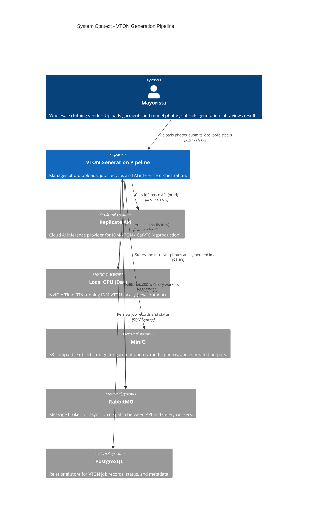

# VTON Generation Pipeline - System Context

## System Overview

The VTON Generation Pipeline is the core AI feature of Virtual Closet. It accepts garment photos and model photos, submits inference jobs to IDM-VTON asynchronously via RabbitMQ/Celery, and returns generated try-on images stored in MinIO. The pipeline abstracts the underlying AI provider (local GPU in dev, Replicate in prod) through a common `VTONProvider` interface.

## Context Diagram

## External Integrations

| System | Direction | Data Exchanged | Protocol | Risk |
|--------|-----------|----------------|----------|------|
| **MinIO** | Outbound (write) + Inbound (read) | Garment photos, model photos, generated images | S3 API | Low |
| **RabbitMQ** | Outbound (publish) + Inbound (consume) | VTON task messages | AMQP | Medium |
| **PostgreSQL** | Outbound (read/write) | Job records, status, metadata | SQL async | Low |
| **Replicate API** | Outbound (prod) | Garment URL, model URL, cloth_type → generated image URL | REST | High |
| **Local GPU** | Outbound (dev) | Same as Replicate | Python in-process | Low |

## High-Level Constraints

- The `VTONProvider` interface must be used for all inference calls — no direct Replicate SDK calls outside the provider
- `cloth_type` is mandatory on every inference call (`upper_body`, `lower_body`, `dress`)
- Celery workers are stateless — all state in PostgreSQL; no in-memory job state
- All file access to mayoristas is through short-lived MinIO pre-signed URLs (15 min TTL), never permanent public URLs
- Authentication is a pre-condition — all endpoints require a valid JWT session (mayorista must already exist)

## Key NFR Goals

- Job submission API response < 500ms (async — worker handles the heavy work)
- Inference completion < 60s (local dev), < 120s (Replicate prod)
- Permanent failure rate < 5% after retries
- Job ownership enforced at row level — mayoristas can only access their own jobs
