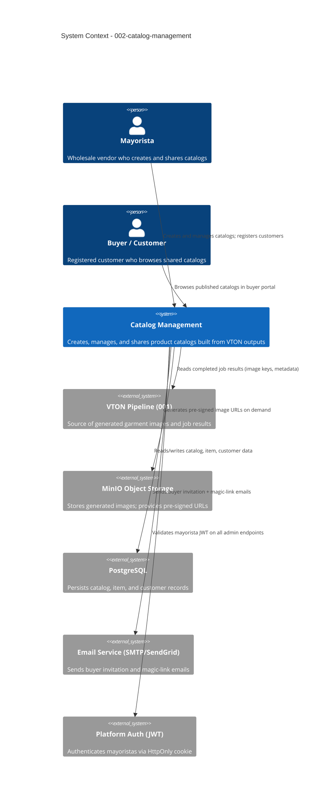

# Catalog Management - System Context

## System Overview

The Catalog Management feature extends the Virtual Closet platform. Mayoristas curate named product collections from their VTON-generated images, attach product metadata (name, price, cloth type, SKU), and share published catalogs with registered customers through a secure buyer portal. Two distinct actor roles exist: the mayorista (catalog manager) and the buyer (read-only portal consumer).

## Context Diagram

## Actors

| Actor | Type | Description |
|-------|------|-------------|
| Mayorista | Human | Creates catalogs, curates items, registers buyers, publishes |
| Buyer / Customer | Human | Accesses buyer portal, browses published catalogs |
| VTON Pipeline (001) | Internal System | Provides completed job results consumed by this intent |
| Email Service | External System | Delivers invitation and magic-link login emails |

## External Integrations

| System | Direction | Data Exchanged | Protocol |
|--------|-----------|----------------|----------|
| VTON Pipeline (001) | Inbound | Completed job `result_url`, `cloth_type`, `mayorista_id` | Internal DB read (PostgreSQL) |
| MinIO | Outbound | Pre-signed URL generation for image keys | MinIO SDK |
| PostgreSQL | Both | Catalog, CatalogItem, Customer records | Django ORM |
| Email Service | Outbound | Invitation email with signed token link | SMTP / SendGrid REST |
| Platform Auth (JWT) | Inbound | Mayorista JWT validation on admin endpoints | Middleware |

## Data Flows

### Inbound
- Mayorista REST requests (catalog CRUD, item management, customer registration) via `POST/PATCH/DELETE /api/catalogs/*` and `/api/customers/*`
- Buyer REST requests (catalog browsing) via `GET /api/portal/*`
- Buyer invitation token in URL query param (authentication)

### Outbound
- Catalog and item data to mayorista and buyer clients (JSON)
- MinIO pre-signed image URLs (short-lived, 15 min) — generated on demand, not stored
- Invitation / magic-link emails to registered buyers

## High-Level Constraints

- Catalog items must reference completed VTON jobs (`status: completed`) — no in-progress or failed images
- Image URLs are MinIO pre-signed (short-lived) — generated on-demand at read time, not persisted
- Mayorista auth is existing platform JWT HttpOnly cookie — not built in this intent
- Draft catalogs are not accessible to buyers — publish gate enforced at API layer
- Buyers are scoped to exactly one mayorista — no cross-mayorista catalog access

## Key NFR Goals

- Catalog list and detail API responses: < 300–500ms p95
- Row-level isolation enforced in all queries (mayorista and buyer scope)
- Buyer session tokens: 7-day TTL; magic-links: 15-min TTL
