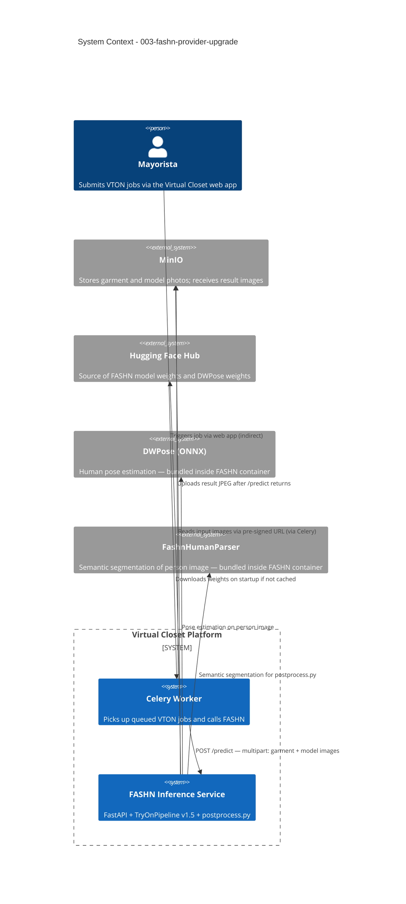

# FASHN Provider Upgrade - System Context

## System Overview

The FASHN inference service is a FastAPI container (`docker/fashn/`) that wraps the FASHN v1.5 TryOnPipeline. It receives a garment image and a model/person image, runs diffusion-based virtual try-on, applies post-processing, and returns a JPEG result. This intent improves the quality of that output by tuning `postprocess.py` (hand compositing, conditional leg repair) and validating the results across multiple subjects.

The service sits inside the Virtual Closet platform and is called exclusively by a Celery worker after a mayorista submits a VTON job. No external user interacts with the FASHN container directly.

## Context Diagram

## External Integrations

- **Celery Worker**: Only caller of `/predict` and `/classify` — passes garment + model images, receives JPEG
- **MinIO**: Input photos are fetched by the Celery worker before calling FASHN; result is uploaded by the Celery worker after
- **Hugging Face Hub**: Model weights downloaded once at startup (`fashn-ai/fashn-vton-1.5`, `fashn-ai/DWPose`) — cached in Docker volume
- **DWPose (ONNX)**: Bundled within the FASHN container — used internally for pose estimation during generation
- **FashnHumanParser**: Bundled within the FASHN container — used by `postprocess.py` for semantic segmentation (label IDs: `face`, `arms`, `hands`, `torso`, `dress`, `skirt`, `pants`, `top`, `feet`)

## High-Level Constraints

- FASHN v1.5 `TryOnPipeline.__call__` does not accept a hand/limb preservation mask — post-gen compositing is the only viable approach
- `postprocess.py` must not change the `/predict` API contract — same multipart inputs, same JPEG output
- Human parser must be called on CPU (initialized with `device="cpu"`) — GPU is reserved for the diffusion pipeline
- All thresholds (`_PANTS_AREA_RATIO`, luminance, color distance, blur kernels) must be named constants with documented rationale

## Key NFR Goals

- **Zero regressions**: Previously passing cases must not break after tuning
- **Postprocess latency**: Hand compositing + conditional leg check adds < 3s to total job time
- **Determinism**: Same inputs + same seed → same output bytes (enables before/after MD5 comparison)
- **Observability**: Every postprocess decision (hands skipped, pants detected, bare legs) logged at INFO level
