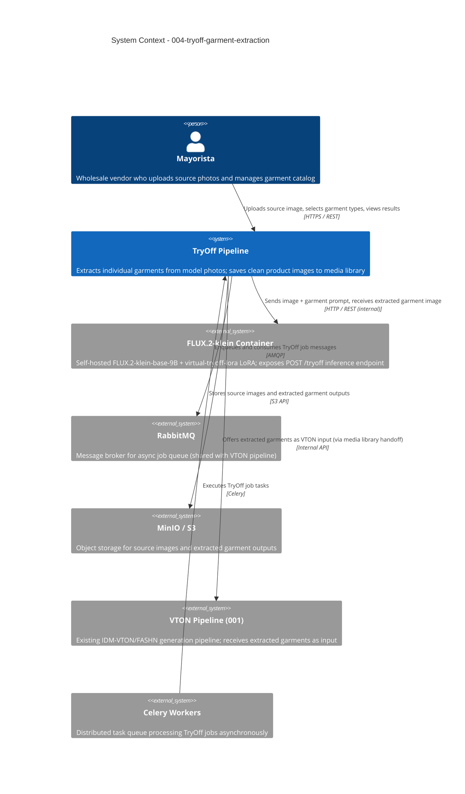

# TryOff Garment Extraction - System Context

## System Overview

A new async pipeline that accepts source photos (editorial or product) of models wearing clothing, runs garment extraction via a self-hosted FLUX.2-klein Virtual Try-Off LoRA container, and delivers clean product-photography images to the mayorista's media library. Each extracted garment becomes a first-class media item that can feed directly into the existing VTON generation pipeline.

## Context Diagram

## Actors

- **Mayorista** (Human): Primary user. Uploads source images, selects garments to extract, monitors job status, views extracted garments in media library, initiates VTON handoff.
- **Celery Worker** (System): Consumes job queue messages, calls the FLUX.2-klein inference container, persists output to MinIO, updates job status.
- **FLUX.2-klein Container** (System): Self-hosted GPU inference service exposing a single POST /tryoff endpoint. Accepts image + text prompt, returns extracted garment image.

## External Systems

| System | Direction | Data Exchanged | Protocol | Risk |
|--------|-----------|----------------|----------|------|
| FLUX.2-klein Container | Outbound | Source image + garment prompt → extracted garment PNG | HTTP/REST (internal) | High — GPU dependency |
| RabbitMQ | Both | Job messages (job_id, image_path, garment_type) | AMQP | Medium — shared infra |
| MinIO / S3 | Both | Source images (inbound), extracted garments (outbound) | S3 API | Low — existing infra |
| VTON Pipeline (001) | Outbound | Extracted garment media item reference | Internal API / URL | Low — internal system |
| HuggingFace Hub | Outbound (init only) | Model weights download (build time) | HTTPS | Medium — license check required |

## Data Flows

### Inbound
- **Source image upload**: JPEG/PNG from mayorista → stored in MinIO; job record created in DB
- **Garment type selection**: `upper` / `lower` / `dress` → mapped to FLUX prompt internally
- **Job status poll**: job_id → returns status + output image URL

### Outbound
- **Extracted garment image**: PNG on white background → stored in MinIO, referenced in media library
- **Media library entry**: metadata (garment type, source image ref, job_id) → mayorista's media collection
- **VTON handoff**: extracted garment media item URL → pre-fills VTON job submission form

## High-Level Constraints

- FLUX.2-klein-base-9B requires ~24 GB VRAM; must run on dedicated GPU node or time-share with FASHN container
- All async job processing must use existing Celery/RabbitMQ infrastructure — no new broker
- Extracted garment output must be compatible with VTON pipeline input format (JPEG/PNG, min 768×1024 px)
- Self-hosted only — no fal.ai cloud API calls in production
- HuggingFace license for FLUX.2-klein-base-9B must be verified for commercial self-hosting before implementation

## Key NFR Goals

- Extraction latency p95 < 90 seconds per garment
- Auto-retry: max 2 retries on failure before marking job failed
- GPU memory isolation: TryOff container restarts cleanly on OOM (same pattern as FASHN)
- Media library items queryable within 1 second of job completion
