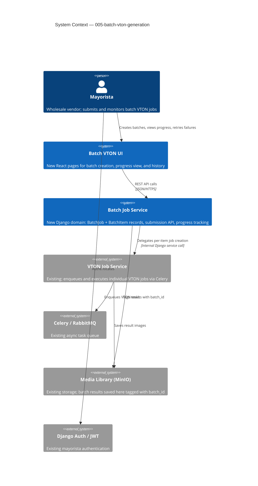

# Batch VTON Generation — System Context

## System Overview

The Batch VTON Generation feature extends the existing Virtual Closet platform. A mayorista selects multiple garment+model+cloth_type pairings via a new UI flow and submits them as a named `BatchJob`. The backend creates a `BatchJob` record, enqueues each pairing as a standard `VtonJob` (reusing the existing Celery/RabbitMQ infrastructure), and tracks aggregate progress. Successful job results are automatically saved to the media library tagged with the batch. Failed items are flagged for individual retry.

## Context Diagram

## External Integrations

- **VTON Job Service** (`001-vton-generation-pipeline`): Reused for per-item job execution; batch service delegates individual job creation
- **Celery / RabbitMQ**: Existing queue infrastructure; no new queues needed
- **Media Library / MinIO**: Existing storage; results tagged with `batch_id` and `batch_name`
- **Django Auth / JWT**: Existing mayorista authentication; scopes batch records per mayorista

## High-Level Constraints

- Must reuse the existing Celery worker pool — no new worker infrastructure
- Batch submission must not block the HTTP response; all job enqueue is async
- Individual `VtonJob` execution logic is unchanged; `BatchJob` is a coordination layer on top
- Hard cap of 100 items per batch enforced at the API boundary

## Key NFR Goals

- **Performance**: Batch submission API < 500ms p95 (enqueue only)
- **Reliability**: 1 failed item has zero blast radius on remaining items
- **Security**: Mayorista can only view/manage their own `BatchJob` records
- **Observability**: Per-item status visible in real time; failures include error message
