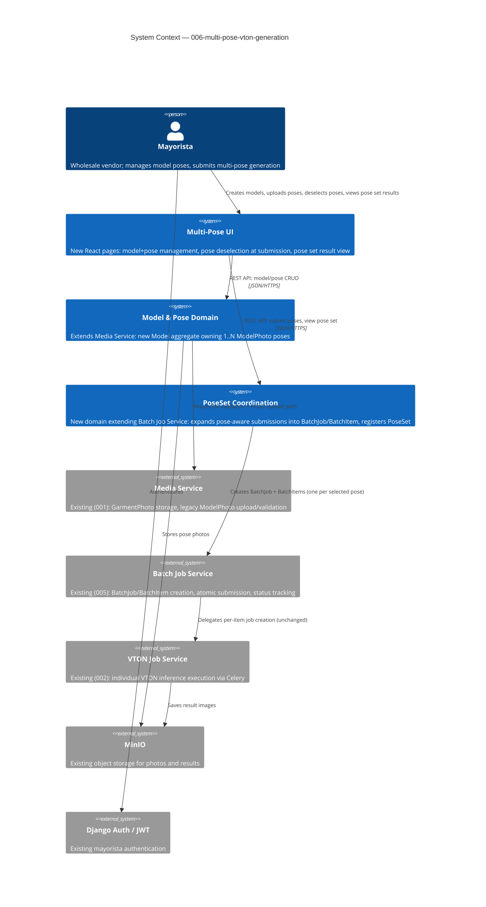

# Multi-Pose VTON Generation - System Context

## System Overview

Multi-Pose VTON Generation extends the existing Virtual Closet platform. A mayorista groups their own model photos under a new `Model` identity, tagging each photo with a fixed pose type (`front`, `side`, `back`). When submitting a garment for VTON generation against a multi-pose `Model`, the mayorista can deselect specific poses before submitting. The system expands the request into the existing `BatchJob`/`BatchItem` pipeline (one item per selected pose) and registers a new `PoseSet` record linking the batch to the model and garment, so results can be retrieved and displayed as one grouped set of multi-angle outputs.

## Context Diagram

## External Integrations

- **Media Service** (`001-vton-generation-pipeline`): Reused for file validation (JPG/PNG, 10MB) and MinIO upload conventions; legacy `ModelPhoto` rows are backfilled into implicit single-pose `Model` wrappers here
- **Batch Job Service** (`005-batch-vton-generation`): Reused unchanged — `PoseSet` submissions create standard `BatchJob`/`BatchItem` records; no parallel execution path
- **VTON Job Service** (`002-vton-job-service`): Unchanged; still executes individual inference jobs via Celery/RabbitMQ, one per `BatchItem`
- **MinIO**: Existing storage; pose photos and per-pose results stored under existing mayorista-namespaced conventions
- **Django Auth / JWT**: Existing mayorista authentication; scopes `Model`, poses, and `PoseSet` records per mayorista

## High-Level Constraints

- Must reuse the existing `BatchJob`/`BatchItem` pipeline — no new job-execution or worker infrastructure
- Pose type is a fixed enumeration (`front`, `side`, `back`); no arbitrary pose labels
- `PoseSet` creation must be atomic with `BatchJob`/`BatchItem` creation
- Legacy `ModelPhoto` rows must be backfilled into single-pose `Model` wrappers with zero data loss
- Curated model library is out of scope — multi-pose applies only to mayorista-uploaded models

## Key NFR Goals

- **Performance**: Pose-set submission API < 500ms p95 (enqueue only), matching existing batch submission NFR
- **Reliability**: No orphaned `PoseSet` without a corresponding `BatchJob`; partial pose failures don't block other poses in the set
- **Security**: Mayorista can only view/manage their own `Model`, poses, and `PoseSet` records
- **Observability**: Per-pose status visible in the pose set view in real time, consistent with existing batch item status visibility
