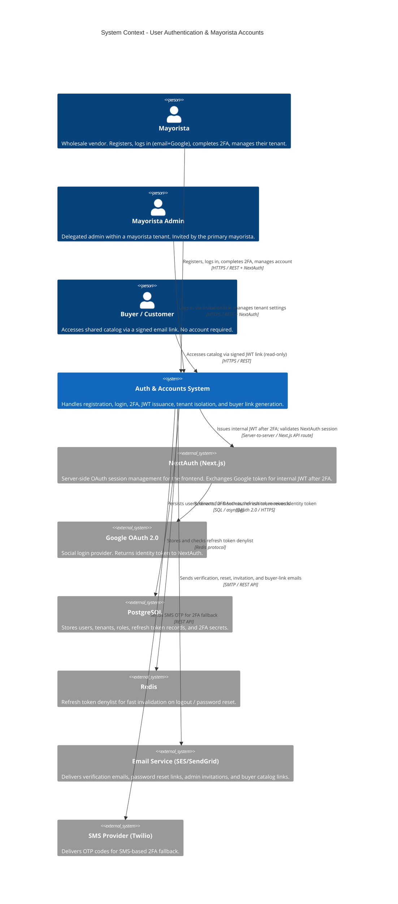

# User Authentication & Mayorista Accounts - System Context

## System Overview

The Authentication & Accounts system provides foundational identity management for Virtual Closet. It introduces multi-tenancy (`tenant_id`) across the platform, handles mayorista registration and login via email+password or Google OAuth (NextAuth), enforces mandatory TOTP 2FA with SMS fallback, manages admin sub-roles within mayorista tenants, and grants buyers stateless catalog access via signed JWT links — without requiring buyer accounts.

## Context Diagram

## External Integrations

| System | Direction | Data Exchanged | Protocol | Risk |
|--------|-----------|----------------|----------|------|
| **Google OAuth 2.0** | Outbound (redirect) + Inbound (token) | Identity token (email, name, sub) | OAuth 2.0 / HTTPS | Medium |
| **NextAuth (Next.js)** | Bidirectional | Google identity → NextAuth session → internal JWT | Server-to-server / Next.js API routes | Medium |
| **PostgreSQL** | Outbound (read/write) | Users, tenants, roles, 2FA secrets, refresh tokens | SQL / asyncpg | Low |
| **Redis** | Outbound (read/write) | Refresh token JTI denylist | Redis protocol | Low |
| **Email Service (SES/SendGrid)** | Outbound | Verification links, reset links, invitations, buyer catalog URLs | SMTP / REST | Medium |
| **SMS Provider (Twilio)** | Outbound | 6-digit OTP codes | REST API | Medium |

## High-Level Constraints

- **`tenant_id` is introduced here** — all existing and future entities (`media`, `catalogs`, `jobs`, `batches`) must be backfilled or schema-migrated to include `tenant_id` as a foreign key to the new `tenants` table
- **NextAuth handles Google OAuth session on the frontend** — backend issues its own JWT only after NextAuth session is verified AND 2FA is passed; the NextAuth session alone does not grant API access
- **2FA is mandatory for all mayorista and admin roles** — no route to skip or defer; enforced at the JWT issuance step, not per-endpoint
- **Buyer tokens are catalog-scoped JWTs** — signed with a per-tenant secret; no server-side state for buyer sessions
- All endpoints require HTTPS; auth cookies (if any) are `SameSite=Strict; Secure; HttpOnly`
- SMS OTP is a fallback only; TOTP setup is presented first

## Key NFR Goals

- Login + 2FA flow end-to-end < 1s (p95) under normal load
- Refresh token validation < 150ms (p95) including Redis denylist check
- Zero cross-tenant data leakage — enforced at ORM layer and validated by integration tests
- Refresh token denylist supports instant revocation (< 50ms Redis write)
- Email delivery for verification and reset < 30 seconds (provider SLA)
