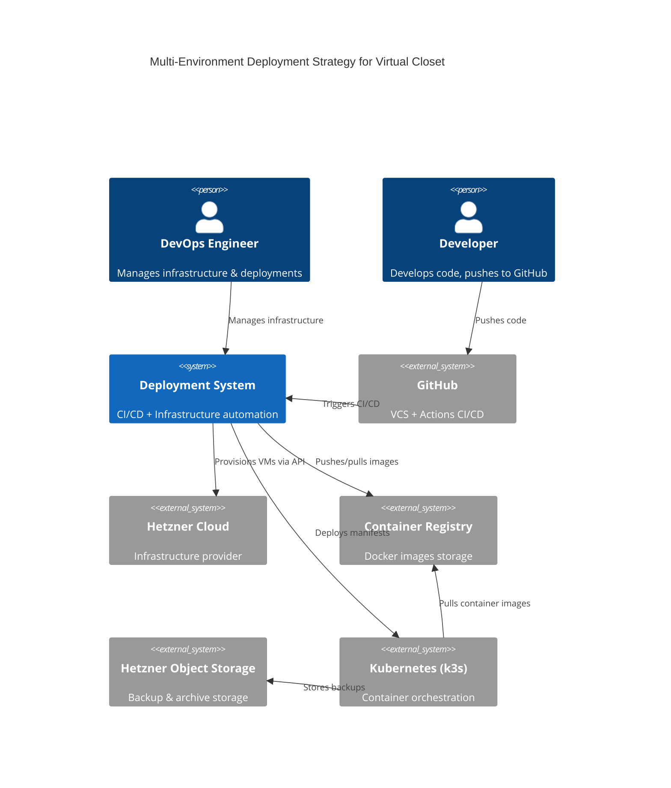

# Multi-Environment Deployment Strategy — System Context

## System Overview

A comprehensive deployment and infrastructure strategy for Virtual Closet, spanning three environments (development, staging, production). The system orchestrates automated building, testing, and deployment of containerized services (Next.js frontend, FastAPI backend, PostgreSQL database, RabbitMQ, MinIO, Celery workers) using modern DevOps practices (Infrastructure-as-Code, CI/CD pipelines, Kubernetes orchestration).

## Actors

| Actor | Type | Description |
|-------|------|-------------|
| **DevOps Engineer** | Human | Designs and maintains infrastructure, manages deployments, troubleshoots issues |
| **Developer** | Human | Develops code locally, pushes to GitHub, receives deployment feedback |
| **CI/CD System** | Automated | GitHub Actions: builds images, runs tests, triggers deployments |
| **Kubernetes Operator** | System | k3s cluster: schedules pods, manages storage, monitors health |
| **Infrastructure Provider** | External | Hetzner Cloud: provides VMs, networking, object storage, load balancing |

## External Systems & Integrations

| System | Type | Direction | Purpose | Protocol |
|--------|------|-----------|---------|----------|
| **Hetzner Cloud** | Infrastructure | Outbound | Virtual machine provisioning, networking, networking | REST API (hcloud) |
| **Hetzner Object Storage** | Storage | Outbound | PostgreSQL backup storage, cost $0.023/GB | S3-compatible REST |
| **GitHub** | VCS + CI/CD | Bidirectional | Source code repository, Actions CI/CD triggers | HTTPS/REST |
| **Docker Hub / Private Registry** | Registry | Outbound | Container image storage and pull | HTTPS/REST |
| **Kubernetes (k3s)** | Orchestration | Inbound | Pod scheduling, service mesh, health monitoring | kubectl API |

## System Boundaries

```
┌─────────────────────────────────────────────────────────────────┐
│                    DEPLOYMENT SYSTEM                             │
│                                                                  │
│  ┌──────────────────────────────────────────────────────────┐   │
│  │  CI/CD Pipelines (GitHub Actions)                        │   │
│  │  - Build, test, push images                              │   │
│  │  - Staging deploy automation                             │   │
│  │  - Health check validation                               │   │
│  └──────────────────────────────────────────────────────────┘   │
│                                                                  │
│  ┌──────────────────────────────────────────────────────────┐   │
│  │  Kubernetes Cluster (k3s on Hetzner)                     │   │
│  │  - Control Plane (CX21)                                  │   │
│  │  - Worker Nodes (CX31)                                   │   │
│  │  - Stateful Services (PostgreSQL, MinIO, RabbitMQ)       │   │
│  │  - Deployments (Frontend, Backend, Celery)               │   │
│  │  - Ingress / Load Balancing                              │   │
│  │  - Persistent Volumes (backups, data)                    │   │
│  └──────────────────────────────────────────────────────────┘   │
│                                                                  │
│  ┌──────────────────────────────────────────────────────────┐   │
│  │  Infrastructure as Code (Terraform + hcloud)             │   │
│  │  - Cluster provisioning                                  │   │
│  │  - Network configuration                                 │   │
│  │  - Secret and ConfigMap management                       │   │
│  └──────────────────────────────────────────────────────────┘   │
└─────────────────────────────────────────────────────────────────┘
         ▲                               ▲
         │                               │
         │ Terraform API                 │ Hetzner Cloud API
         │                               │
    ┌────┴───────────────────────────────┴─────┐
    │   Hetzner Infrastructure                   │
    │   (VMs, Storage, Networking)               │
    └──────────────────────────────────────────┘
```

## Data Flows

### Inbound Data

| Source | Data | Format | Validation |
|--------|------|--------|-----------|
| GitHub Repository | Source code commits | Git refs | Branch protection, PR reviews |
| GitHub Actions Secrets | Deployment credentials | JSON env vars | OIDC token verification |
| Developer Machine | docker-compose.yml, Helm values | YAML/YAML | Schema validation |

### Outbound Data

| Destination | Data | Format | Guarantee |
|-------------|------|--------|-----------|
| Hetzner Cloud | Cluster config, node specs | Terraform state | Idempotent infrastructure |
| Docker Registry | Container images | Docker image format | Signed/tagged image |
| k8s Cluster | Manifests, secrets, ConfigMaps | YAML | Applied via kubectl |
| Hetzner Object Storage | PostgreSQL backups | SQL dump (gzipped) | Daily, 30-day retention |

## High-Level Constraints

1. **Infrastructure as Code**: All infrastructure provisioning must be reproducible via Terraform + hcloud
2. **Cost Optimization**: Use Hetzner VPS only, no managed services (except Object Storage). StatefulSets over managed databases
3. **Security Posture**: Secrets never in git; k8s Secrets for staging; OIDC for CI/CD authentication
4. **Zero-Downtime Deployments**: Rolling updates with health checks; readiness probes prevent traffic to unready pods
5. **Multi-Environment Parity**: Dev (Docker Compose) mirrors staging/prod (k3s) as closely as possible
6. **Observability Baseline**: kubectl logs + health checks for MVP; Prometheus+Grafana deferred to Phase 2

## Key NFR Goals

| NFR | Target | Rationale |
|-----|--------|-----------|
| **Deployment Time** | < 15 minutes end-to-end | Enable fast feedback loops, reduce developer friction |
| **Availability** | 99% uptime on staging | Reliable staging environment for pre-release validation |
| **Recovery Speed** | < 5 minutes RTO for pod failures | Rapid auto-recovery via k8s; < 2 min for liveness probes |
| **Security** | Secrets encrypted at rest, TLS in transit | Protect sensitive credentials and data |
| **Cost Efficiency** | Minimize resource footprint on Hetzner | Fit within budget constraints; scale elastically |
| **Maintainability** | IaC for all infrastructure, documented runbooks | Reduce manual toil; enable knowledge transfer |

## Dependencies & Assumptions

| Dependency | Assumption | Risk Mitigation |
|------------|-----------|-----------------|
| Hetzner availability | Uptime SLA of 99.9% | Accept transient failures; implement backup datacenter strategy later |
| GitHub Actions API | Reliable CI/CD execution | Implement retry logic; monitor action logs |
| Container registry availability | Registry uptime for image pulls | Use local image cache on nodes; mirror images to multiple registries |
| Kubernetes API stability | k3s cluster remains healthy | Health checks + liveness probes auto-recover; monitor API server metrics |
| Network connectivity | Latency < 100ms between nodes and storage | Hetzner same-region deployment ensures low latency |

## Future Integrations (Phase 2+)

- **Prometheus + Grafana**: Metrics collection and visualization
- **Loki / ELK Stack**: Centralized logging
- **ArgoCD**: GitOps-based deployments (alternative to GitHub Actions)
- **Sealed Secrets / Vault**: Advanced secret management
- **Service Mesh (Istio)**: Traffic management, observability, security policies
- **PostgreSQL HA**: Replication, automated failover (replace single primary)

## Context Diagram



## Key System Properties

| Property | Description |
|----------|-------------|
| **Scalability** | Horizontal: add k8s nodes; Vertical: increase node resources |
| **Resilience** | Self-healing via liveness probes; rolling updates prevent downtime |
| **Auditability** | Terraform state + git commit history + k8s audit logs |
| **Repeatability** | Infrastructure as Code ensures reproducible environments |
| **Cost Transparency** | All resources on Hetzner; backup costs tracked separately |
