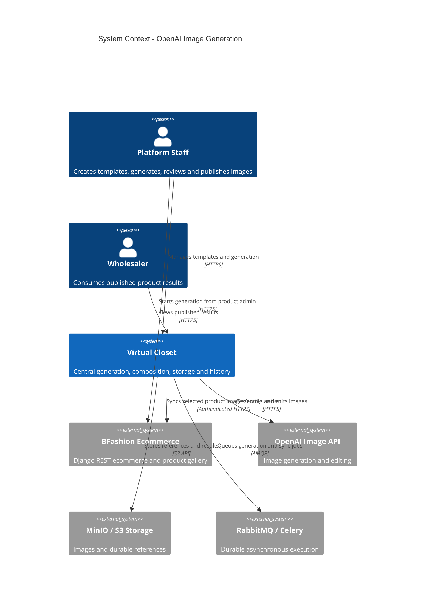

# System Context: 008-openai-image-generation

## Purpose and Boundary

Virtual Closet centraliza la generación, edición y extracción de imágenes con OpenAI. El staff puede iniciar trabajos desde Virtual Closet o desde la administración del ecommerce BFashion; BFashion no ejecuta inferencia. Virtual Closet conserva trabajos, plantillas, imágenes y configuraciones, y sincroniza únicamente resultados seleccionados por el staff.

## Actors

- **Staff de plataforma** (Human): crea y mantiene plantillas, inicia trabajos, revisa resultados y publica imágenes.
- **Administrador de mayorista** (Human): puede ser el contexto propietario de productos y resultados privados, pero no genera ni administra plantillas bajo este intent.
- **Mayorista / comprador** (Human): solo consume resultados publicados; no accede a borradores, configuraciones privadas ni operaciones de generación.
- **Virtual Closet** (System): coordina autorización, trabajos asíncronos, proveedores, composición determinista, almacenamiento e historial.
- **BFashion Admin** (System): ofrece una entrada alternativa para staff y mantiene la galería del producto externo.
- **Celery/RabbitMQ** (System): ejecuta trabajos asíncronos y entrega eventos internos.

## External Systems

- **OpenAI Image API**: generación y edición de imágenes; outbound HTTPS; riesgo alto por coste, disponibilidad, límites y calidad variable.
- **BFashion** (`~/dev/bfashion/ecommerce`): ecommerce Django REST + React/Vite; integración bidireccional de comandos de staff, resultados seleccionados y configuración; riesgo alto por identidad y contratos cross-repo.
- **MinIO/S3-compatible storage**: imágenes, referencias y artefactos; acceso interno/presigned; riesgo medio por expiración y consistencia.
- **PostgreSQL**: persistencia de plantillas, trabajos, versiones, vínculos y auditoría dentro de Virtual Closet.
- **RabbitMQ/Celery**: cola y ejecución de inferencia/composición/publicación.

## Data Flows

### Inbound

- Solicitudes autenticadas de staff desde Virtual Closet o BFashion: modo, producto, mayorista, proveedor, plantilla, prompt, referencias y clave de idempotencia.
- Imágenes binarias o referencias almacenadas en MinIO/S3.
- Respuestas de OpenAI: imagen codificada, estado, modelo, uso disponible y errores/rate limits.
- Confirmaciones de BFashion: vínculo de producto, aceptación de imagen/configuración y estado de sincronización.

### Outbound

- Solicitudes HTTPS servidor a servidor a OpenAI sin exponer la API key.
- Estados y resultados de trabajos a las interfaces de staff.
- Imágenes finales y configuración efectiva a BFashion solo después de selección explícita.
- Eventos internos a Celery/RabbitMQ para trabajo durable.
- Resultados y referencias persistentes a MinIO/S3 y metadatos a PostgreSQL.

## Trust Boundaries

1. El navegador no recibe `OPENAI_API_KEY` ni puede decidir por sí solo el tenant, staff actor o producto destino.
2. BFashion y Virtual Closet se autentican como servicios y validan autorización de staff en cada operación.
3. Los datos de un mayorista se aíslan de otros; los resultados privados no se vuelven públicos por sincronización fallida.
4. La imagen generada se considera `completed` para revisión solo tras persistir el archivo y configuración.

## Context Diagram

## Context Decisions

- OpenAI is a provider option for model try-on and the provider for text, edit and extraction modes; the existing VTON provider remains available.
- Staff manages templates in Virtual Closet in V1; both applications can select templates and initiate generation.
- The integration must use explicit product/wholesaler links, not SKU-only inference.

## Open Context Questions

- Exact staff identity and service-auth contract between repositories.
- Whether BFashion stores a full immutable configuration snapshot or a reference plus snapshot.
- Operational limits and model verification after account provisioning.
