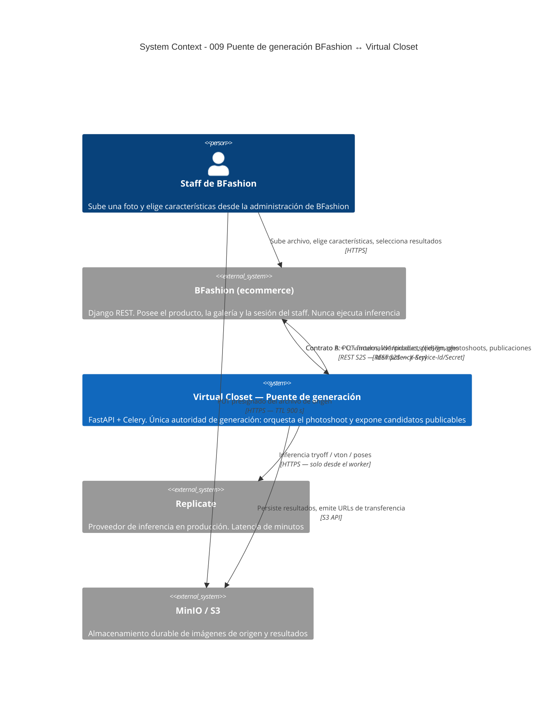
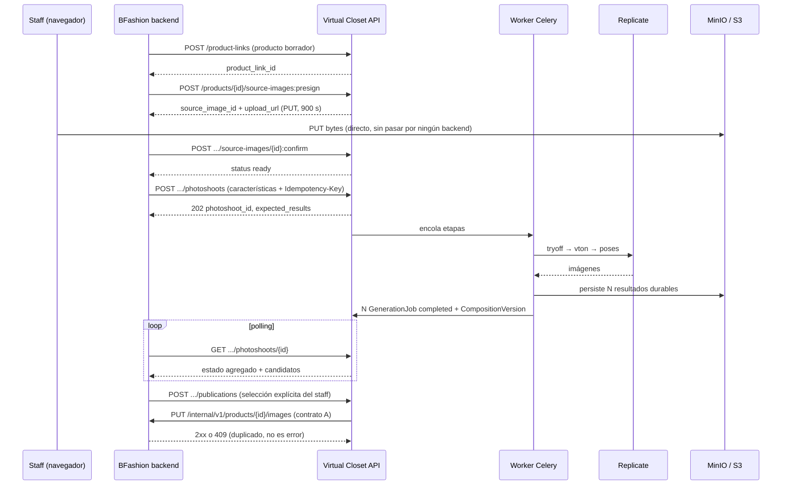

# Puente de generación BFashion ↔ Virtual Closet — System Context

## System Overview

Virtual Closet expone un puente servidor-a-servidor que convierte **un archivo de imagen y una descripción de características** en **N imágenes de producto publicables**. El consumidor es el backend de BFashion, que actúa en nombre de un usuario con permiso de staff.

La frontera es explícita: BFashion posee el producto, su galería y la sesión del staff; Virtual Closet posee la media, la inferencia, los resultados y la decisión de qué es publicable. Ningún byte de inferencia ni ninguna credencial de proveedor cruzan hacia BFashion. Lo único que cruza de vuelta es una URL de transferencia de vida corta y una clave de almacenamiento durable.

Este intent **no construye interfaz**. La pantalla que ve el staff vive en BFashion (intent `020-ai-product-imagery-integration`).

## Actors

| Actor | Tipo | Cómo entra al sistema | Qué puede hacer |
|-------|------|-----------------------|-----------------|
| **Staff de BFashion** | Humano (indirecto) | Nunca llama a Virtual Closet directamente. Su identidad viaja como `staff_id` asertado por el backend de BFashion y se valida contra un `Mayorista` espejo | Subir un archivo, elegir características, disparar un photoshoot, seleccionar resultados |
| **Backend de BFashion** | Sistema | `X-Service-Id` + `X-Service-Secret` contra `service_clients` | Todo el contrato B y C, siempre acotado a su tenant |
| **Navegador del staff** | Sistema | URL presignada `PUT`, acotada a una clave y a un TTL | Subir bytes directamente al almacenamiento de Virtual Closet. Nada más |
| **Worker Celery** | Sistema | Interno | Ejecutar etapas, llamar al proveedor de IA, persistir resultados. Único contexto donde viven las credenciales de proveedor |
| **Operador de plataforma** | Humano | Scripts (`provision_service_client.py`) | Dar de alta el `ServiceClient` de BFashion y el tenant |

## External Systems

| Sistema | Dirección | Datos que cruzan | Protocolo | Riesgo |
|---------|-----------|------------------|-----------|--------|
| **BFashion (ecommerce)** | Ambas | Entrante: identificadores de producto y staff, características del photoshoot, decisiones de publicación. Saliente: clave durable, URL de transferencia, snapshot de configuración | REST/JSON con autenticación de servicio mutua | Alto — contrato compartido con un intent en desarrollo paralelo |
| **Replicate** | Saliente | Imágenes de entrada, parámetros de inferencia | HTTPS, SDK `replicate` | Alto — latencia de minutos, coste por llamada, límites de tasa |
| **MinIO / S3** | Ambas | Bytes de imágenes de origen y resultados; URLs presignadas de subida, descarga y transferencia | S3 API (`aiobotocore`) | Medio — el endpoint público debe ser alcanzable por el navegador del staff |
| **RabbitMQ / Celery** | Interna | Solo identificadores de trabajo (ADR-047) | AMQP | Medio — entregas duplicadas, mitigadas por lease e idempotencia |
| **PostgreSQL** | Interna | Vínculos, identidades espejo, photoshoots, etapas, jobs, selecciones, entregas | SQLAlchemy async | Bajo |

## Context Diagram

## Flujo de usuario objetivo (V1)

## Data Flows

### Inbound (BFashion → Virtual Closet)

| Dato | Formato | Validación |
|------|---------|------------|
| Identidad de servicio | Cabeceras `X-Service-Id` / `X-Service-Secret` | bcrypt contra `service_clients`; `ServiceClient` y tenant activos. Fail-closed |
| `external_product_id` | String | Debe resolver un `ProductLink` activo del mismo tenant. Nunca se infiere propiedad de un SKU |
| `staff_id` | UUID | Debe existir en `mayorista`, con rol en `{admin, owner, staff}`, mismo tenant que el vínculo y espejo no revocado |
| `external_staff_id` | String (PK entera de Django, como texto) | Idempotente por `(system, external_staff_id)` |
| Bytes del archivo de origen | `image/jpeg` o `image/png` | Vía `PUT` presignado, nunca por el backend. Tipo y tamaño reales verificados en `:confirm` |
| Características del photoshoot | JSON | `input_kind`, modelos, poses, `cloth_type`, overlay. Combinaciones no soportadas se rechazan con `422` antes de encolar |
| Decisión de publicación | JSON | Solo `selected` o `discarded`, siempre explícita |

### Outbound (Virtual Closet → BFashion)

| Dato | Formato | Garantía |
|------|---------|----------|
| `photoshoot_id` + estado agregado | JSON | Derivado de etapas y resultados; `completed` significa revisable, nunca publicado |
| `candidates[]` | JSON, forma de `PublicationCandidateResponse` | Un solo lector en BFashion para candidatos de photoshoot y de job |
| `storage_key` | String durable | Sobrevive a la caducidad de cualquier URL |
| `transfer_url` | URL presignada 900 s | Reemitible desde `storage_key` sin regenerar la imagen |
| `configuration` | JSON snapshot | Copia inmutable de la configuración efectiva |
| `preview_url` | URL presignada de vida corta | Nunca se expone una clave como si fuese pública |

### Outbound (Virtual Closet → Replicate)

Solo desde el worker. Las credenciales se resuelven dentro del contexto del worker y jamás aparecen en respuestas HTTP, en registros ni en el navegador.

## High-Level Constraints

- Capas `api/routers → services → repositories → models`. El orquestador vive en `services/`.
- Alembic obligatorio tras cualquier cambio en `backend/models/`.
- Contratos A y B congelados en este intent. El contrato C es nuevo y está compartido con el intent `020`.
- Un único tenant en juego; el aislamiento por `tenant_id` no se relaja en ninguna consulta nueva.
- Los pipelines cookie-auth existentes se consumen, no se sustituyen ni se migran.
- Sin frontend nuevo en Virtual Closet.

## Key NFR Goals

- Rutas S2S con p95 ≤ 1 s excluyendo transferencia e inferencia; el disparo responde `202` sin esperar etapas.
- Tope global configurable de llamadas simultáneas al proveedor (propuesta: 2); el excedente encola y no falla.
- Timeout por proveedor ≥ 900 s para Replicate; un timeout con resultado desconocido no se reintenta solo.
- Contabilidad de uso que reconozca la forma de Replicate; lo no informado queda `unknown`, nunca cero.
- Un fallo de sincronización con BFashion nunca pierde ni oculta un resultado ya generado.
- Cross-tenant, cross-product y staff desconocido o revocado fallan cerrado en todos los endpoints nuevos.

## Frontera explícita con el intent hermano

| Responsabilidad | Dueño |
|-----------------|-------|
| Pantalla de subida, selección de características y galería del staff | BFashion (intent 020) |
| Tabla `StaffIntegrationIdentity` y comando `manage.py link_staff_identity` | BFashion (intent 020) |
| Endpoint `PUT /internal/v1/products/{id}/images` (recepción del contrato A) | BFashion (intent 020) |
| Producto borrador y `ProductVariant(color_label)` | BFashion (intent 020) |
| Aprovisionamiento del `Mayorista` espejo y su revocación | **Virtual Closet (este intent)** |
| Presign, confirmación y registro de la media de origen | **Virtual Closet (este intent)** |
| Orquestación del photoshoot y estado agregado | **Virtual Closet (este intent)** |
| Materialización de candidatos publicables | **Virtual Closet (este intent)** |
| Ejecución contra Replicate, concurrencia, timeouts y consumo | **Virtual Closet (este intent)** |
